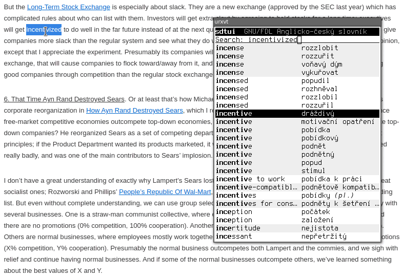

StarDict Terminal and Graphical UI
==================================

'sdtui' aims to provide an easy way of viewing translation as well as other
kinds of dictionaries in your terminal, and is inspired by the dictionary
component of PC Translator.  I wasn't successful in finding any free software
of this kind, GUI or not, and thus decided to write my own.

The project is covered by a permissive license, unlike vast majority of other
similar projects, and can serve as a base for implementing other dictionary
software.

As a recent addition, there is now an alternative GTK+ 3 based frontend as well,
called 'sdgui'.  It shares its dictionary list with 'sdtui', but styling will
follow your theme, and may be customized from 'gtk.css'.

Packages
--------
Regular releases are sporadic.  git master should be stable enough.  You can get
a package with the latest development version from Archlinux's AUR.

Documentation
-------------
See the link:docs/sdtui.1.adoc[man page] for information about usage.
The rest of this README will concern itself with externalities.

Building and Running
--------------------
Build dependencies: CMake, pkg-config, asciidoctor, librsvg (for the GUI) +
Runtime dependencies: ncursesw, zlib, ICU, termo (included), glib-2.0 >= 2.38,
 pango, xcb, xcb-xfixes (the latter two optional for the TUI),
 gtk+-3.0 (for the GUI)

 $ git clone --recursive https://git.janouch.name/p/sdtui.git
 $ mkdir sdtui/build
 $ cd sdtui/build
 $ cmake .. -DCMAKE_INSTALL_PREFIX=/usr -DCMAKE_BUILD_TYPE=Debug \
   -DWITH_X11=ON -DWITH_GUI=ON
 $ make

To install the application, you can do either the usual:

 # make install

Or you can try telling CMake to make a package for you.  For Debian it is:

 $ cpack -G DEB
 # dpkg -i sdtui-*.deb

Having the program installed, simply run it with a StarDict '.ifo' file as
an argument.  It is, however, preferable to
link:docs/sdtui.1.adoc#_configuration[configure it] to load your dictionaries
automatically.

Windows
~~~~~~~
With the help of Mingw-w64 and WINE, 'sdgui' will successfully cross-compile
for Windows.  It isn't particularly usable on that system, if only because
selection watching is a very X11/Wayland-specific feature.  Beware that build
dependencies take up almost a gigabyte of disk space.

 $ sh cmake/Win64Depends.sh
 $ cmake -DCMAKE_TOOLCHAIN_FILE=cmake/Win64CrossToolchain.cmake \
   -DCMAKE_BUILD_TYPE=Release -B build
 $ cmake --build build -- package

Dictionaries
------------
This application is intended for use with specific dictionaries: each line
should contain one short word definition.  Moreover, the only supported content
types are plain text, Pango markup, and XDXF (the visual format works better).

The `make dicts` command will build some examples from freely available sources:

 - GNU/FDL Czech-English dictionary
 - Czech foreign words
 - Czech WordNet 1.9 PDT (synonyms, hypernyms, hyponyms)

You can use the included 'transform' tool to convert already existing StarDict
dictionaries that are nearly good as they are.  Remember that you can change
the `sametypesequence` of the resulting '.ifo' file to another format, or run
'dictzip' on '.dict' files to make them compact.

https://mega.co.nz/#!axtD0QRK!sbtBgizksyfkPqKvKEgr8GQ11rsWhtqyRgUUV0B7pwg[CZ <--> EN/DE/PL/RU dictionaries]

Further Development
-------------------
While I've been successfully using 'sdtui' for many years now, some work has to
be done yet before the software can be considered fit for inclusion in regular
Linux and/or BSD distributions:

 - The tab bar and the text input field don't handle overflows well in the TUI.
 - Lacking configuration, standard StarDict locations should be scanned.

Given all issues with the file format, it might be better to start anew.

Contributing and Support
------------------------
Use https://git.janouch.name/p/sdtui to report any bugs, request features,
or submit pull requests.  `git send-email` is tolerated.  If you want to discuss
the project, feel free to join me at ircs://irc.janouch.name, channel #dev.

Bitcoin donations are accepted at: 12r5uEWEgcHC46xd64tt3hHt9EUvYYDHe9

License
-------
This software is released under the terms of the 0BSD license, the text of which
is included within the package along with the list of authors.
